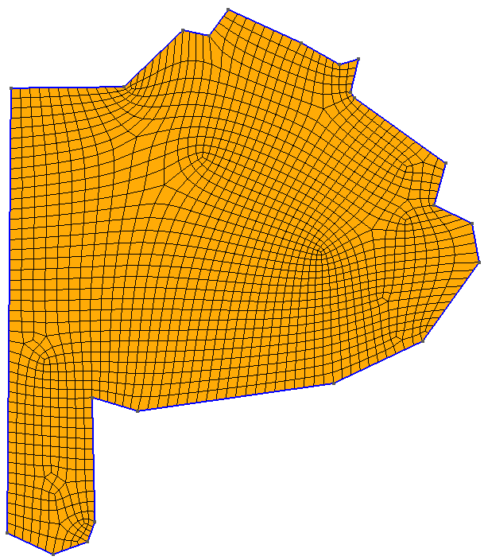

# Geospatial Places Finder

This application queries the Google Places API to gather information about specific business queries in various locations. The results are saved in an Excel file. The center locations to make the neccesary queries are created using `gmsh` so in that way a grid of points that maps the region is provided.



## Table of Contents

- [Installation](#installation)
- [Usage](#usage)
- [Project Structure](#project-structure)
- [Map Goordinates functionality](#Map-Goordinates-functionality)
- [Query Google API Places functionality](#Query-Google-API-Places-functionality)
- [Dependencies](#dependencies)
- [Contributing](#contributing)
- [License](#license)

## Installation

1. Clone the repository:
    `
    git clone https://github.com/GABusta/api_places.git
    cd geospatial-places-finder
    `

3. Install the required dependencies:
    `
    pip install -r requirements.txt
    `

4. Set up your Google Places API key in the environment variables:
    copy the `.env-sample` and rename it as `.env` and replace with your own key 

    `API_KEY=<replace with your google places api key>`

## Usage

1. Edit the `main.py` file to set the desired state, query, and additional fields:
    ```
    state = "buenos_aires"
    query = "veterinaria"
    extra_fields = ["formatted_phone_number", "website", "url", "address_component"]
    ```

2. Run the application:
    on root folder
    `python main.py`

3. The results will be saved in a CSV file named `values_found_{state}.csv`.

## Project Structure

```plaintext
geospatial-places-finder/
│
├── files/
│   └── save_to_file.py
│ 
├── map_coordinates/
│   │── boundaries/
│   │   └── states.txt
│   │── centroids/
│   │    └── centroids_{model_name}.txt
│   │── files_map_logic/
│   │   │── map_grid_generation.py
│   │   │── map_grid_reader.py
│   │   │── object_phases.py
│   │   └── mesh_files/
│   │        └── states.msh
│   │  
│   └── main_grid.py
│ 
├── main.py
├── requirements.txt
├── README.md
└── .env
```

- **files/**: Contains the script to save the data to a CSV file.
- **map_coordinates/**: Contains te boundaries files for each state, the centroid data used for location searches and the neccesary logic for calculate the centroids.
- **requirements.txt**: Lists the Python dependencies.
- **README.md**: This file.


## Map Goordinates functionality

This application is designed to generate and process a mesh for a specified region using the Gmsh library. It calculates the centroids of the mesh elements and saves them for further use. Below is an overview of the main functionalities:

* **Generate Mesh:** Creates a mesh for a specified region with a defined element size using Gmsh.
* **Read Mesh File:** Reads the generated mesh file and processes its elements.
* **Calculate and Save Centroids:** Calculates the centroids of each mesh element and saves them in a file for use in further analyses or queries.

The `main_grid.py` script orchestrates these functionalities to automate the process of generating a mesh, reading the mesh file, calculating centroids, and saving the results.

### Example Workflow
* **Specify Mesh Parameters:**
Define the `model_name` for the region to be meshed.
Set the `size_element` to determine the size of each mesh element.

* **Generate the Mesh:**
The script generates a mesh file for the specified region and element size.

* **Read and Process Mesh File:**
The script reads the generated mesh file, processes the mesh elements, and calculates their centroids.

* **Save Centroid Data:**
The calculated centroid coordinates are saved in a file for further use.


## Query Google API Places functionality

This application is designed to query the Google Places API to gather detailed information about various places based on specified keywords and locations. The results are saved in a CSV file for further analysis. Below is an overview of the main functionalities:

* **Fetch Place Details:** Retrieves comprehensive details about a specific place using the place's unique ID.
* **Search Nearby Places:** Performs a nearby search based on a central location (latitude and longitude), a keyword, and a specified radius. Fetches additional details for each place found.
* **Load Centroid Locations:** Reads centroid coordinates from a file to use as central points for the nearby searches.
* **Save Results to CSV:** Stores the fetched place details into a CSV file with relevant information for easy access and analysis.

The `main.py` script orchestrates these functionalities to automate the process of querying and saving place information.

## Dependencies

- Python 3.11.2

Install the dependencies using:
`pip install -r requirements.txt`

## Contributing

Feel free to submit issues or pull requests if you have suggestions or improvements.

## License

This project is licensed under the MIT License. See the [LICENSE](LICENSE) file for more details.
